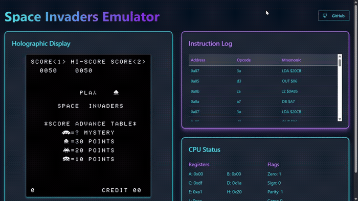

# Intel 8080 Emulator — Space Invaders

A cycle-accurate Intel 8080 emulator written in Rust from scratch, running the original Space Invaders ROM. Ships two frontends: a native SDL2 desktop build and a WebAssembly build with a React UI.

> The core emulator (CPU, memory, interrupt handling, shift-register hardware) was written entirely from scratch. The web frontend was built with LLM assistance.

## Demo



> Tab to insert a coin · 1 to start · ← → to move · Space to fire

---

## Prerequisites

### Web build
| Tool | Install |
|------|---------|
| Rust + Cargo | [rustup.rs](https://rustup.rs) |
| wasm-pack | `curl https://rustwasm.github.io/wasm-pack/installer/init.sh -sSf \| sh` |
| Node.js ≥ 18 | [nodejs.org](https://nodejs.org) |

### Native SDL2 build
SDL2 must be installed as a system library.

| Platform | Command |
|----------|---------|
| macOS | `brew install sdl2` |
| Debian / Ubuntu | `sudo apt install libsdl2-dev` |
| Arch Linux | `sudo pacman -S sdl2` |
| Windows | Install SDL2 development libraries and add them to your library path |

---

## Building & Running

### Web emulator (recommended)

Build the WASM package and start the dev server in one step:

```bash
./scripts/dev-web.sh
```

Or run the steps separately:

```bash
# 1. Compile Rust → WASM
./scripts/build-wasm.sh

# 2. Start the frontend
cd i8080-web && npm install && npm run dev
```

Open [http://localhost:5173](http://localhost:5173).

### Native SDL2 emulator

```bash
./scripts/build-native.sh
./target/release/i8080_emulator
```

---

## Controls

| Key | Action |
|-----|--------|
| Tab | Insert Coin |
| 1 | 1 Player Start |
| 2 | 2 Player Start |
| ← / → | Move Left / Right |
| Space | Fire |

---

## Project Structure

```
├── src/
│   ├── emulator/       # Core Intel 8080 CPU emulation
│   ├── bin/            # Entry points (native SDL2 + WASM stub)
│   └── space_invaders_wasm.rs  # WASM bindings & framebuffer renderer
├── i8080-web/          # React + Vite frontend
│   └── public/wasm/    # Generated WASM package (output of build-wasm.sh)
├── roms/               # ROM files (space_invaders, gunfight, cpu_diag)
├── libs/               # SDL2 link libraries (Windows)
└── scripts/
    ├── build-wasm.sh   # Compile Rust to WASM
    ├── build-native.sh # Compile native SDL2 binary
    └── dev-web.sh      # build-wasm + start Vite dev server
```

---

## Notes

- **SDL2 (native build):** The `libs/` directory contains SDL2 link libraries for Windows. On Linux and macOS, Cargo links against the system-installed SDL2. You do **not** need to copy any DLL alongside the binary on Linux/macOS — install SDL2 via your package manager as shown above.
- The web build uses an `OffscreenCanvas` for off-thread compositing, with the framebuffer rendered at native 224 × 256 and scaled up via CSS (`image-rendering: pixelated`).
